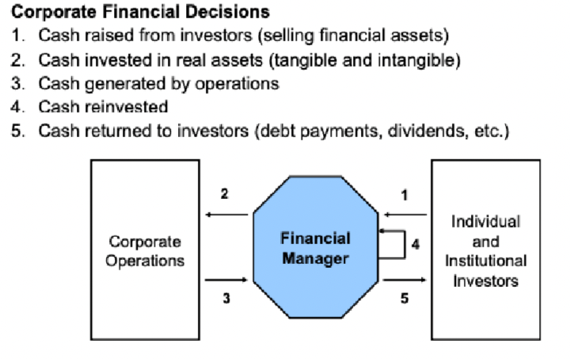
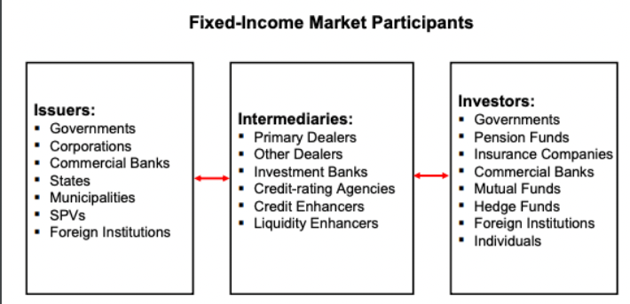
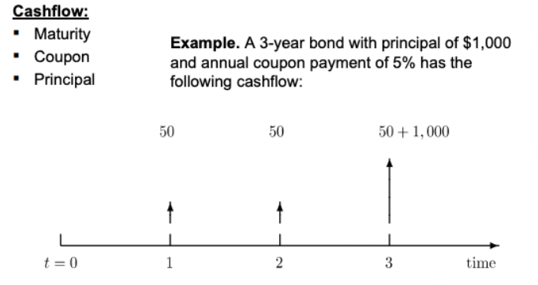
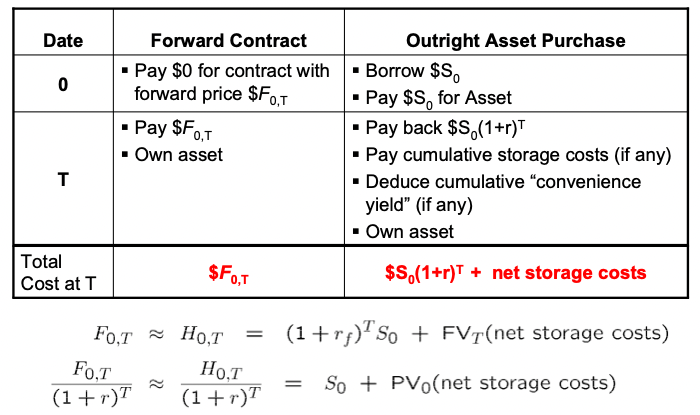

# Finance 101

[[book]](https://marcelodelfino.net/files/Brealey__Myers_y_Allen_2009_Principles_of_corporate_finance.pdf) 
[[course]](https://ocw.mit.edu/courses/15-401-finance-theory-i-fall-2008/)

### Basics
* 2 fundamental challenges of finance
  * **Valuation** of assets(real/financial, tangible/intangible)
    * How *are* financial assets be valued?
    * How *should* financial assets be values?
    * How do financial markets determine asset values?
    * How well do financial markets work?
  * **Management** of assets(acquiring/selling)
    * How much should I save/spend?
    * What/When should I buy/sell?
    * How should I finance the transaction?

* 2 factors that make finance challenging
  * **Time**
    * $1 now is different from $1 later
  * **Risk**
    * uncertainty
  * How to address these 2 issues?
    * use historical data
    * use math(probability & stats)

* 2 frameworks of financial analysis
  * **Accounting**
  * **Balance Sheet & Income Statement**
    * Balance Sheet: snapshot of financial status quo
    * Income Statement: rate of change of the status quo
    

---

### Present Value relations
* Assets & Cash flows
  * From a business perspective, an asset is a sequence of cash flows. (current & future)
    * Assets = {CF_t, CF_t+1, CF_t+2, ...}

* Valuing an asset requires valuing a seq of cash flows.
  * Value of asset_t = V_t(CF_t, CF_t+1, CF_t+2, ...)
  * Net Present value of asset_0 = V_0(CF_0, CF_1, CF_2, ...)
    * if there's an init investment, then CF_0 < 0
    * assume:
      * cash flows are known
      * discount factors are known
      * no frictions in conversion (no txn fees)
  * in terms of interest rate(opportunity cost of capital /  growth rate) r:
    * FV -> PV: 1/(1 + r)^T in year 0 = $1 in year T
    * PV -> FV: $1 in year 0 = 1*(1 + r)^T
    * => V_0 = CF_0 + CF_1 / (1 + r) + CF_2 / (1 + r)^2 + ...

* The Perpetuity
  * pays constantly forever
  * assume: pays constant cash flow C each year
    * PV = C / (1+r) + C / (1+r)^2 + C / (1+r)^3 + ...
    * (1+r) * PV = C + C / (1+r) + C / (1+r)^2 + ...
    * => PV = C / r
  * assume: pays cash flow C(1+g)^t each year
    * PV = C / (1+r) + C*(1+g) / (1+r)^2 + ...
    * => PV = C / (r-g), r>g

* The Annuity
  * pays for a period
  * assume: pays constant cash flow C for T periods
    * PV = C / (1+r) + C / (1+r)^2 + ... + C / (1+r)^T
    * => PV = C/r - C/r * (1 / (1+r)^T)

* Compounding
  * Interest credited/charged more often than annually
  * APR: claimed interest rate
  * EAR: effective interest rate (consider compounding)
  * EAR = (1 + APR / n)^n - 1 (as if compounded annually)

* Inflation
  * change in real purchasing power of $1 over time
  * at time t: Wealth W_t, Cost of Living I_t
  * at time t+k, W_t+k, I_t+k
    * => increase in cost of live: I_t+k / I_t = (1 + x)^k
    * => real wealth: W_t+k' = W_t+k / (1+x)^k
    * => real return: (1+r_real)^k = W_t+k' / W_t
      * => W_t+k / W_t * (1 / (1+x)^k)
      * => r_real = r_nominal - x

---

### Fixed income securities
* Industry overview
  * Fixed-income securities are financial claims with promised cash flows of known fixed amount paid at fixed dates. 
  * 

* Valuation
  * 

  * Valuation of discount bonds
    * pure discount bond / zero-coupon bond
      * Definition: no coupons, single payment of principal at maturity
      * bond trades at a discount to face value
      * P0 = F / (1+r)^T (assume r is constant)
      * what if r varies over time?
        * denote r_t the spot rate of interest at year t
        * P0 = F / (1+r_0,T)^T (r_0,T is today's T-year spot rate)
        * P_t-1 / P_t = 1 + f_t (f_t is one-year forward rate)
          * forward interest rate are today's rates for txn between future dates t1 & t2. 

    * coupon bond
      * P0 = C/(1+y) + C/(1+y)^2 + ... + (C+F)/(1+y)^T (y: yield)

---

### Equity
* What is Common Stock?
  * Equity, an ownership position, in a corporation
  * payouts are dividends, in 2 forms: cash dividends, stock dividends
  * payouts are uncertain in both magnitude and timing

---

### Forwards & Futures contracts

* Diff
  * Forwards & Futures:
  A contract to exchange an asset in the future at specified price and time.
  * Options:
  Gives the holder the right to buy(call option) or sell(put option) an asset at a specified price.
  * Swaps:
  An agreement to exchange a series of cash flows at specified prices and times.

* Forward Contracts
  * Definition: A forward contract is a commitment to purchase at a future data a given amount of a commodity or an asset at a price agreed on today.
  * The price fixed now for futures exchange is the ***forward price***.
  * The buyer of the underlying is said to be "long" the forward.

  * Features:
    * Customized, not traded on OTC
    * No money changes hands until maturity
    * Non-trivial counterparty risk

  * Limitations:
    * Illiquidity
    * Counterparty risk

* Futures Contracts
  * Definition: A future contract is an exchange-trade, standardized, forward-like contract that is marked-to-market daily. This contract can be used to establish a long(or short) position in the underlying asset.

  * Features:
    * Standardized: underlying, quantity, maturity
    * Exchange traded
    * Guaranteed by the clearing house - no counterparty risk
    * gains/losses settled daily (marked to market)
    * margin required as collateral to cover losses

* Valuation of Forwards & Futures
  * Notations
    * Spot price of underlying at t: S_t
    * Forward price: S_t_T
    * Futures price: F_t_T
    * assume S_t_T == F_t_T

  * 2 ways to buy the underlying for date T delivery
    * buy a forward/futures contract with maturity T
    * buy the underlying and store it until T
  
  